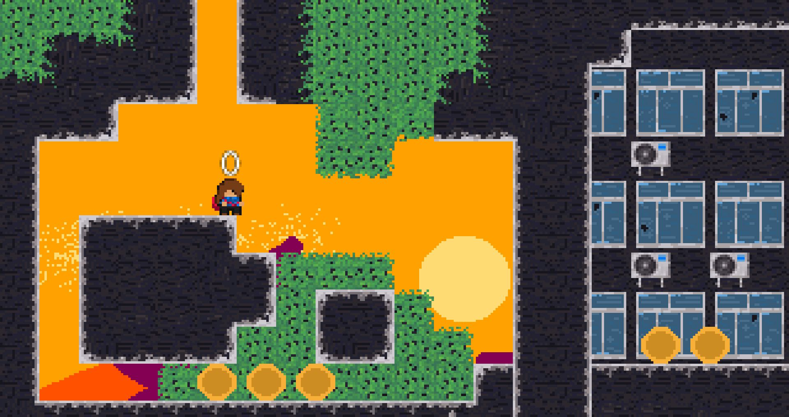

# Aka Engine



Small 2D game engine, mainly built for personal educational purpose, to be easy to use and to extend. Its main target is pixel art game, and its pipeline is built around [Ogmo editor](https://ogmo-editor-3.github.io/) for level creation and [aseprite](https://www.aseprite.org/) for sprite creation.

Aka stand for red in japanese (赤) and there is no particular reason for this name, we just need one !

## Features
- Run with OpenGL 3.2 / DirectX 11 using Batch rendering
- Basic sound support with RtAudio
- Easily implement new window library / platform

## How to use
```cpp
struct Game : aka::Application
{
	void initialize() override;
	void destroy() override;
	void update(aka::Time::Unit deltaTime) override;
	void render() override;
};
int main()
{
	Game app;
	aka::Config cfg;
	cfg.width = 1280;
	cfg.height = 720;
	cfg.name = "Game";
	cfg.app = &app;
	aka::Game::run(cfg);
	return 0;
}
```

## Build
-   Run --recursive with git clone or git submodule init / update to get all dependencies.
-   This project was build using Visual Studio 2019 under Windows 10. Others versions have not been tested.

## RoadMap
-   More robust physic engine or use third party like [Box2D](https://box2d.org/)
-   Add multiple shapes for colliders
-   Use stb_true_type for less big dependencies (freetype)
-   Parse aseprite files directly
-   Project to CMake to support build for Linux
-   Add support for joystick
-   Compatibility with linux
-   Save ECS state in config file
-   Let's work on a game !
